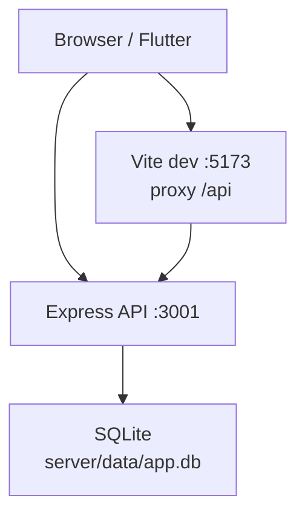
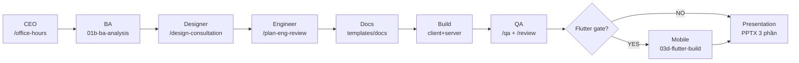

# CourtBook

Ứng dụng **đặt sân thể thao** mobile-first: cầu lông, mini bóng đá, tennis. Web responsive, full-stack thật (Express + SQLite), được xây dựng bằng pipeline AI **gstack** với custom layer **Role Council + Full-Stack + Flutter Gate**.

**Repository:** [github.com/iVoGia/CourtBook](https://github.com/iVoGia/CourtBook)

---

## Tính năng chính

- **Xác thực:** đăng ký, đăng nhập; phân quyền User và Admin
- **Danh sách sân:** tên, môn thể thao, sức chứa, giá theo giờ
- **Đặt sân:** chọn sân → ngày → khung giờ (1–3 giờ) → thông tin khách → xác nhận và tính giá
- **Booking của tôi:** xem booking sắp tới / đã qua; hủy theo chính sách 24 giờ
- **Quản trị:** trang Admin quản lý sân và booking (mở rộng ngoài MVP)
- **Giao diện tiếng Việt**, responsive từ **375px** (mobile) đến desktop
- **Mobile app (tuỳ chọn):** Flutter dùng chung REST API với web

### Quy tắc nghiệp vụ

- Khung giờ hoạt động: 06:00–22:00
- Đặt trước tối thiểu 2 giờ
- Không trùng lịch; số người chơi ≤ sức chứa sân

---

## Tech stack

| Layer | Công nghệ |
|-------|-----------|
| Web frontend | React 19, TypeScript, Vite 8, Tailwind CSS 4, React Router 7 |
| Backend | Node.js, Express 4, TypeScript |
| Database | SQLite (`better-sqlite3`) |
| Mobile (optional) | Flutter 3.5+ |
| AI workflow | [gstack](https://github.com/garrytan/gstack) v1.58.4.0 + Role Council custom layer |

---

## Cấu trúc dự án

```
CourtBook/
├── README.md                      ← tài liệu chính (file này)
├── SPORT_BOOKING_SPEC.md          ← đặc tả sản phẩm
├── 02-gstack/                     ← workspace gstack + Role Council
│   ├── CUSTOM_FRAMEWORK.md        ← định nghĩa custom pipeline
│   ├── GSTACK_BATTLE_WORKFLOW.md  ← timeline 60 phút
│   ├── MASTER_PROMPT.md           ← entry prompt cho Cursor Agent
│   ├── prompts/                   ← prompt theo từng role
│   ├── .cursor/skills/gstack/     ← gstack factory (upstream vendored)
│   └── app/                       ← ★ ứng dụng CourtBook
│       ├── client/                ← React web (:5173)
│       ├── server/                ← Express API (:3001)
│       ├── mobile/                ← Flutter (optional)
│       └── docs/                  ← BA_BRIEF, PRD, api-spec, QA_REPORT, ...
├── scripts/                       ← bootstrap, verify-docs, scaffold
└── stack-template*/               ← template khởi tạo dự án mới
```

---

## Yêu cầu hệ thống

| Mục đích | Yêu cầu |
|----------|---------|
| **Chạy app (bắt buộc)** | Node.js 20+, npm, Git |
| **Flutter mobile (tuỳ chọn)** | Flutter SDK (`flutter doctor`) |
| **AI workflow (tuỳ chọn)** | Cursor IDE, Bun (gstack browse binary), Python 3 + `python-pptx` (tạo slide) |

Không cần Docker hay file `.env` — cấu hình mặc định dùng localhost.

---

## Cài đặt & chạy

### 1. Clone repository

```bash
git clone https://github.com/iVoGia/CourtBook.git
cd CourtBook/02-gstack/app
```

### 2. Cài dependency và khởi tạo database

```bash
npm install
npm run db:init
```

Lệnh `db:init` tạo file SQLite tại `server/data/app.db` và seed dữ liệu demo (sân, tài khoản).

### 3. Chạy development

```bash
npm run dev
```

Lệnh này khởi động đồng thời API server và Vite dev server.

| Dịch vụ | URL |
|---------|-----|
| Web app | http://localhost:5173 |
| REST API | http://localhost:3001/api |
| Health check | http://localhost:3001/api/health |

### 4. Tài khoản demo

Mật khẩu chung: **`demo123`**

| Email | Vai trò | Mục đích |
|-------|---------|----------|
| `user@demo.com` | User | Đặt sân, xem/hủy booking |
| `admin@demo.com` | Admin | Quản trị sân và booking |

Chi tiết: [`02-gstack/app/docs/DEMO_ACCOUNTS.md`](02-gstack/app/docs/DEMO_ACCOUNTS.md)

### 5. Flutter mobile (tuỳ chọn)

API phải đang chạy (`npm run dev` từ thư mục `app/`).

```bash
cd mobile
flutter pub get
flutter run
```

| Nền tảng | URL API |
|----------|---------|
| iOS Simulator | `http://localhost:3001` |
| Android Emulator | `http://10.0.2.2:3001` |
| Thiết bị thật | `http://<LAN-IP>:3001` — sửa `lib/core/config/api_config.dart` |

### 6. Production build

```bash
npm run build   # build client
npm start       # chạy server production
```

---

## Kiến trúc ứng dụng



Luồng dữ liệu: client gọi `/api` (Vite proxy trên web) → Express REST → SQLite. Flutter gọi trực tiếp API `:3001`.

---

## gstack là gì?

**[gstack](https://github.com/garrytan/gstack)** (Garry Tan's software factory) là bộ **AI skills** cho phát triển phần mềm. Mỗi skill đóng vai một chuyên gia:

| Skill | Vai trò |
|-------|---------|
| `/office-hours` | Brainstorm sản phẩm, thu hẹp MVP |
| `/plan-eng-review` | Review kiến trúc, lock API + data flow |
| `/plan-design-review` | Review thiết kế UI, chấm điểm 0–10 |
| `/design-consultation` | Tạo design system, viết `DESIGN.md` |
| `/design-review` | Visual QA trên site thật, sửa lỗi giao diện |
| `/review` | Code review trước khi merge |
| `/qa` | QA browser thật, tìm bug và sửa |
| `/browse` | Headless Chromium (~100ms/lệnh) cho QA |
| `/ship` | Test, bump version, tạo PR |

Trong repo này, gstack được **vendored** tại [`02-gstack/.cursor/skills/gstack/`](02-gstack/.cursor/skills/gstack/) (phiên bản **v1.58.4.0**), cài cho Cursor qua `./setup --host cursor`. Khoảng 50 skill symlink tại `02-gstack/.cursor/skills/gstack-*`.

---

## Custom layer: Role Council Pipeline

gstack factory đầy đủ, nhưng team **custom thêm một lớp orchestration** gọi là **Role Council + Full-Stack + Flutter Gate** — tối ưu cho xây sản phẩm demo trong 60 phút với chất lượng cao.

Định nghĩa đầy đủ: [`02-gstack/CUSTOM_FRAMEWORK.md`](02-gstack/CUSTOM_FRAMEWORK.md)

### gstack gốc vs custom

| | gstack gốc | Custom Role Council |
|---|-----------|---------------------|
| **Nội dung** | ~50 skills độc lập (`/qa`, `/ship`, ...) | Pipeline tuần tự + prompts + Cursor rules |
| **Vai trò** | Agent tự chọn skill phù hợp | Council role cố định: CEO → BA → Designer → Eng → QA |
| **Artifact** | Tuỳ skill | Mỗi bước bắt buộc output (`BA_BRIEF.md`, `DESIGN.md`, ...) |
| **Full-stack** | Không bắt buộc | Client + Express + SQLite — cấm mock-only |
| **Mobile** | Không có gate | Flutter gate sau khi web QA pass |
| **Presentation** | Không có | PPTX 3 phần: sản phẩm / gstack / custom |

### Vì sao custom?

1. **BA trước design** — phân tích đề có hệ thống trước khi vẽ UI
2. **Designer có research** — WebSearch + `/browse` tham khảo, khóa `DESIGN.md` responsive
3. **Full-stack thật** — không mock API
4. **Flutter gate** — chỉ gen mobile sau khi web responsive OK
5. **PPTX tách 3 phần** — demo rõ sản phẩm vs framework vs custom layer

### Pipeline Role Council



### Bảng vai trò chi tiết

| Role | Skill / Prompt | Output bắt buộc |
|------|----------------|-----------------|
| CEO | `/office-hours` | MVP scope sketch |
| **BA** | [`prompts/01b-ba-analysis.md`](02-gstack/prompts/01b-ba-analysis.md) | [`docs/BA_BRIEF.md`](02-gstack/app/docs/BA_BRIEF.md) |
| **Designer** | [`prompts/02-design-system.md`](02-gstack/prompts/02-design-system.md) + `/design-consultation` | [`DESIGN.md`](02-gstack/app/DESIGN.md) |
| Designer gate | `/plan-design-review` | UI ≥ 8/10 |
| Engineer | `/plan-eng-review` | API + SQLite locked |
| Docs | [`prompts/02b-eng-and-docs.md`](02-gstack/prompts/02b-eng-and-docs.md) | PRD, api-spec, governance docs |
| Build | [`prompts/03-build-design-led.md`](02-gstack/prompts/03-build-design-led.md) | `client/` + `server/` |
| Designer QA | `/design-review` | Polish + test 375px |
| Eng QA | `/review` | Code review |
| QA | `/qa` + [`prompts/03-qa.md`](02-gstack/prompts/03-qa.md) | [`QA_REPORT.md`](02-gstack/app/docs/QA_REPORT.md) |
| Handoff | [`prompts/03e-handoff-scorecard.md`](02-gstack/prompts/03e-handoff-scorecard.md) | HANDOFF + SCORECARD |
| Mobile* | [`prompts/03d-flutter-build.md`](02-gstack/prompts/03d-flutter-build.md) | `mobile/` Flutter |
| Present | [`prompts/04-presentation-gstack.md`](02-gstack/prompts/04-presentation-gstack.md) | PPTX 3 phần |

\*Chỉ chạy sau **Flutter gate YES** (user chọn có gen mobile).

### Enforcement — 15 quy tắc Cursor

Custom layer được enforce qua [`02-gstack/.cursor/rules/gstack-battle.mdc`](02-gstack/.cursor/rules/gstack-battle.mdc):

1. Đọc `GSTACK_BATTLE_WORKFLOW.md` và `CUSTOM_FRAMEWORK.md` trước
2. BA trước design — `BA_BRIEF.md` từ `01b-ba-analysis.md`
3. Designer trước code — `DESIGN.md` + plan-design-review ≥ 8/10
4. Designer được dùng WebSearch và `/browse` research (3–5 phút)
5. Eng lock API + SQLite trước scaffold
6. Docs bắt buộc: core + governance (WORKFLOW_MANIFEST, TRACEABILITY, ...)
7. `DEMO_ACCOUNTS.md` + seed khi có login
8. `api-spec.md` dùng path cụ thể — chạy `verify-docs.sh` sau QA
9. Full-stack bắt buộc — không mock-only
10. Web responsive bắt buộc — test 375px trước Flutter gate
11. QA phải tạo `QA_REPORT.md`
12. Handoff: HANDOFF + WORKFLOW_SCORECARD + FRAMEWORK_EVIDENCE/
13. Flutter gate sau web QA — AskUserQuestion YES/NO
14. PPTX 3 phần: sản phẩm / gstack / custom
15. Tick `FRAMEWORK_CHECKLIST.md` từng bước

### Deliverables chứng minh pipeline

Trong [`02-gstack/app/docs/`](02-gstack/app/docs/):

| Artifact | Chứng minh |
|----------|------------|
| `BA_BRIEF.md` | Phân tích đề có hệ thống |
| `WORKFLOW_MANIFEST.md` | Pipeline + Definition of Done |
| `TRACEABILITY.md` | Story → API → UI |
| `DESIGN.md` | Design-first + responsive |
| `QA_REPORT.md` | Nghiệm thu khách quan |
| `HANDOFF.md` + `WORKFLOW_SCORECARD.md` | Bàn giao + retro |
| `FRAMEWORK_EVIDENCE/` | Audit framework |

### Pitch 30 giây

> Team custom gstack thành **Role Council Pipeline**: BA phân tích đề, Designer search reference và khóa DESIGN.md responsive, eng lock API SQLite, build web, QA xong hỏi có gen Flutter cùng API. PPTX tách gstack gốc vs custom layer.

---

## Dùng AI workflow với Cursor (tuỳ chọn)

Nếu muốn tái hiện quy trình xây CourtBook bằng AI:

1. Mở folder **`02-gstack`** trong Cursor (File → Open Folder)
2. Mở **Agent mode**, session mới
3. Đọc [`START_HERE.md`](02-gstack/START_HERE.md) và [`GSTACK_BATTLE_WORKFLOW.md`](02-gstack/GSTACK_BATTLE_WORKFLOW.md)
4. Paste [`MASTER_PROMPT.md`](02-gstack/MASTER_PROMPT.md) + đề [`SPORT_BOOKING_SPEC.md`](SPORT_BOOKING_SPEC.md) vào Agent chat
5. Bắt đầu với `/office-hours`, follow timeline Role Council
6. Tick [`FRAMEWORK_CHECKLIST.md`](02-gstack/FRAMEWORK_CHECKLIST.md) từng bước

**Cài lại / cập nhật gstack (nếu cần):**

```bash
# Từ root repo
bash scripts/setup-all.sh
bash scripts/bootstrap-contest.sh
python3 -m pip install -r requirements-pptx.txt   # tạo presentation/output.pptx
```

---

## Tài liệu liên quan

| Tài liệu | Mô tả |
|----------|-------|
| [`SPORT_BOOKING_SPEC.md`](SPORT_BOOKING_SPEC.md) | Đặc tả sản phẩm đầy đủ |
| [`02-gstack/app/docs/api-spec.md`](02-gstack/app/docs/api-spec.md) | REST API reference |
| [`02-gstack/app/docs/PRD.md`](02-gstack/app/docs/PRD.md) | Product requirements |
| [`02-gstack/app/DESIGN.md`](02-gstack/app/DESIGN.md) | Design system CourtBook |
| [`02-gstack/CUSTOM_FRAMEWORK.md`](02-gstack/CUSTOM_FRAMEWORK.md) | Custom pipeline chi tiết |
| [`02-gstack/app/docs/QA_REPORT.md`](02-gstack/app/docs/QA_REPORT.md) | Báo cáo QA |
| [`02-gstack/GSTACK_BATTLE_WORKFLOW.md`](02-gstack/GSTACK_BATTLE_WORKFLOW.md) | Timeline 60 phút |

---

## Verify & troubleshooting

**Đối chiếu api-spec với routes thực tế:**

```bash
# Từ root repo CourtBook
bash scripts/verify-docs.sh 02-gstack/app
```

| Vấn đề | Cách xử lý |
|--------|------------|
| Port 3001 bận | `PORT=3002 npm run dev -w server` (hoặc set env trước khi chạy) |
| DB lỗi / dữ liệu cũ | Xóa `02-gstack/app/server/data/app.db`, chạy lại `npm run db:init` |
| Flutter không kết nối API | Kiểm tra API đang chạy; sửa URL trong `mobile/lib/core/config/api_config.dart` |
| gstack skills không hiện | Mở đúng folder `02-gstack`; chạy `bash scripts/setup-all.sh` |

---

## Credits

- **gstack** — [garrytan/gstack](https://github.com/garrytan/gstack) by Garry Tan
- **CourtBook** — xây dựng bằng gstack Role Council Pipeline trong khuôn khổ AI Adapt Battle
